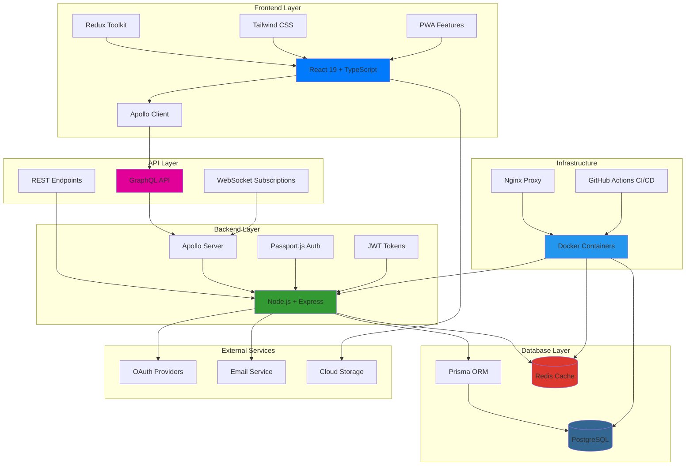

# Groups - Social & Sports Club Management Platform

## Project Overview

Groups is a modern, full-stack web application designed for managing social and sports groups with real-time communication, event management, and member administration. The platform combines enterprise-grade security, scalability, and user experience with a comprehensive tennis league management module.

## Technology Stack Architecture



## Core Technologies

### Frontend Stack

- **React 19**: Latest React with concurrent features and modern hooks
- **TypeScript**: Full type safety across the entire frontend
- **Apollo Client**: GraphQL client with intelligent caching and state management
- **Redux Toolkit**: Predictable state management for complex UI state
- **Tailwind CSS**: Utility-first CSS framework for responsive design
- **Progressive Web App**: Installable app with offline capabilities

### Backend Stack

- **Node.js + Express**: High-performance JavaScript runtime with Express 5
- **GraphQL + Apollo Server**: Type-safe API with real-time subscriptions
- **Prisma ORM**: Type-safe database operations with automatic migrations
- **Passport.js**: Multi-provider authentication (Local, Google, GitHub, Facebook)
- **JWT**: Stateless authentication with secure token management

### Database & Caching

- **PostgreSQL**: ACID-compliant relational database with advanced features
- **Redis**: In-memory caching and session storage for scalability
- **Prisma Schema**: Code-first database modeling with type generation

### Infrastructure & DevOps

- **Docker**: Containerized deployment with multi-stage builds
- **Docker Compose**: Complete development environment orchestration
- **Nginx**: Reverse proxy and static file serving
- **GitHub Actions**: Automated CI/CD pipeline with security scanning

## Key Features

### User Management

- **Multi-Authentication**: Local email/password, Google, GitHub, Facebook OAuth
- **Email Verification**: Secure account activation with email confirmation
- **Password Reset**: Secure password reset flow with rate limiting
- **User Profiles**: Comprehensive profile management with avatars
- **Session Management**: Redis-backed sessions for scalability

### Group Management

- **Group Creation**: Create public/private groups with rich metadata
- **Member Administration**: Role-based access control with admin privileges
- **Member Discovery**: Browse and join public groups
- **Blocking System**: Admin controls for member management

### Real-Time Communication

- **Live Chat**: WebSocket-based messaging within groups
- **Message History**: Persistent chat with pagination
- **GraphQL Subscriptions**: Real-time updates for messages and events

### Event System

- **Event Creation**: Schedule events with rich descriptions
- **RSVP Management**: Multiple response types (Available, Not Available, Maybe, Only if Needed)
- **Event Notifications**: Real-time event updates

### Tennis League Module

- **League Management**: Create and manage tennis leagues
- **Team Organization**: Teams represented by groups
- **Match Scheduling**: Singles and doubles match management
- **Point Systems**: Configurable scoring systems
- **Standings**: Real-time league standings and statistics

## Architecture Highlights

### Database Design

```sql
-- Core entities with snake_case naming (PostgreSQL standard)
users (id, username, email, password_hash, ...)
groups (id, name, description, is_public, ...)
memberships (user_id, group_id, is_admin, member_id, ...)
events (id, group_id, created_by_id, date, description, ...)
messages (id, group_id, user_id, content, created_at, ...)

-- Tennis module entities
team_leagues (id, name, start_date, end_date, ...)
team_league_teams (id, team_league_id, group_id, captain_id, ...)
team_league_team_matches (id, home_team_id, away_team_id, match_date, ...)
team_league_individual_singles_matches (...)
team_league_individual_doubles_matches (...)
```

### Security Features

- **Input Validation**: Joi schemas for all user inputs
- **Rate Limiting**: API endpoint protection with different limits
- **CORS Configuration**: Secure cross-origin resource sharing
- **Security Headers**: Helmet.js for security headers (CSP, HSTS, etc.)
- **Password Security**: bcrypt hashing with configurable rounds
- **Session Security**: HTTP-only cookies with secure flags

### Performance Optimizations

- **Code Splitting**: Lazy loading of React components
- **GraphQL Caching**: Apollo Client normalized cache
- **Redis Caching**: Application-level caching for frequent queries
- **Connection Pooling**: Efficient database connection management
- **Asset Optimization**: Compressed builds with tree shaking

### Development Experience

- **TypeScript**: Full type safety across frontend and backend
- **ESLint**: Enterprise-grade linting with 0 errors
- **Prettier**: Consistent code formatting
- **Hot Reloading**: Fast development iteration
- **GraphQL Playground**: Interactive API exploration
- **Prisma Studio**: Visual database management

## Project Structure

```
groups/
├── client/                     # React frontend application
│   ├── src/
│   │   ├── components/         # React components
│   │   ├── store/             # Redux store and slices
│   │   ├── apollo.ts          # Apollo Client configuration
│   │   └── App.tsx            # Main application component
│   ├── public/                # Static assets
│   └── package.json           # Frontend dependencies
├── server/                     # Node.js backend application
│   ├── src/
│   │   ├── auth/              # Authentication logic
│   │   ├── resolvers/         # GraphQL resolvers
│   │   ├── middleware/        # Express middleware
│   │   └── index.ts           # Server entry point
│   ├── prisma/
│   │   └── schema.prisma      # Database schema
│   └── package.json           # Backend dependencies
├── docker-compose.yml          # Development environment
├── Dockerfile                  # Production container
└── README.md                   # Comprehensive documentation
```

## Data Flow

### Authentication Flow

1. User submits credentials via React form
2. Apollo Client sends GraphQL mutation or REST request
3. Express middleware validates input and rate limits
4. Passport.js handles authentication strategy
5. JWT token generated and returned to client
6. Token stored in localStorage and used for subsequent requests
7. Redis stores session data for scalability

### Real-Time Communication Flow

1. User sends message via React component
2. Apollo Client sends GraphQL mutation
3. GraphQL resolver saves message to PostgreSQL
4. GraphQL subscription publishes message to Redis pub/sub
5. WebSocket connection delivers message to all connected clients
6. React components update in real-time

### Database Operations Flow

1. GraphQL resolver receives request
2. Prisma ORM validates and transforms data
3. Type-safe database query executed against PostgreSQL
4. Results cached in Redis for frequently accessed data
5. Response returned through GraphQL with proper typing

## Deployment Architecture

### Development Environment

- Docker Compose orchestrates PostgreSQL, Redis, and application
- Hot reloading for both frontend and backend
- GraphQL Playground for API testing
- Prisma Studio for database management

### Production Environment

- Multi-stage Docker build for optimized containers
- Nginx reverse proxy for load balancing and SSL termination
- PostgreSQL with connection pooling and read replicas
- Redis cluster for high availability
- GitHub Actions for automated deployment

## Security Considerations

### Authentication Security

- Multi-factor authentication support
- OAuth integration with major providers
- Secure password reset with time-limited tokens
- Session management with Redis for scalability

### API Security

- Rate limiting on all endpoints
- Input validation and sanitization
- CORS configuration for cross-origin requests
- Security headers for XSS and CSRF protection

### Database Security

- Parameterized queries via Prisma ORM
- Role-based access control
- Encrypted connections
- Regular security updates

## Monitoring & Observability

### Application Monitoring

- Health check endpoints for all services
- Structured logging with Winston
- Performance metrics collection
- Error tracking and alerting

### Infrastructure Monitoring

- Container health checks
- Database performance monitoring
- Redis cache hit rates
- Network and resource utilization

## Future Enhancements

### Planned Features

- Mobile app development with React Native
- Advanced analytics and reporting
- Integration with external calendar systems
- Enhanced tennis tournament management
- Multi-language support

### Scalability Improvements

- Microservices architecture migration
- GraphQL federation for service separation
- CDN integration for static assets
- Database sharding for large datasets

## Getting Started

### Prerequisites

- Node.js 18+ and npm
- Docker and Docker Compose
- PostgreSQL 15+ (if running locally)
- Redis 7+ (if running locally)

### Quick Start

```bash
# Clone repository
git clone <repository-url>
cd groups

# Copy environment configuration
cp env.example .env

# Start with Docker (recommended)
docker-compose up -d

# Access application
open http://localhost:4010
```

### Development Setup

```bash
# Install dependencies
npm install
cd server && npm install
cd ../client && npm install

# Setup database
cd server
npx prisma migrate dev
npx prisma generate

# Start development servers
npm run dev
```

This Groups platform represents a modern, scalable approach to social and sports group management, combining the latest web technologies with enterprise-grade security and performance considerations. The modular architecture supports both current requirements and future growth while maintaining excellent developer experience and operational excellence.
